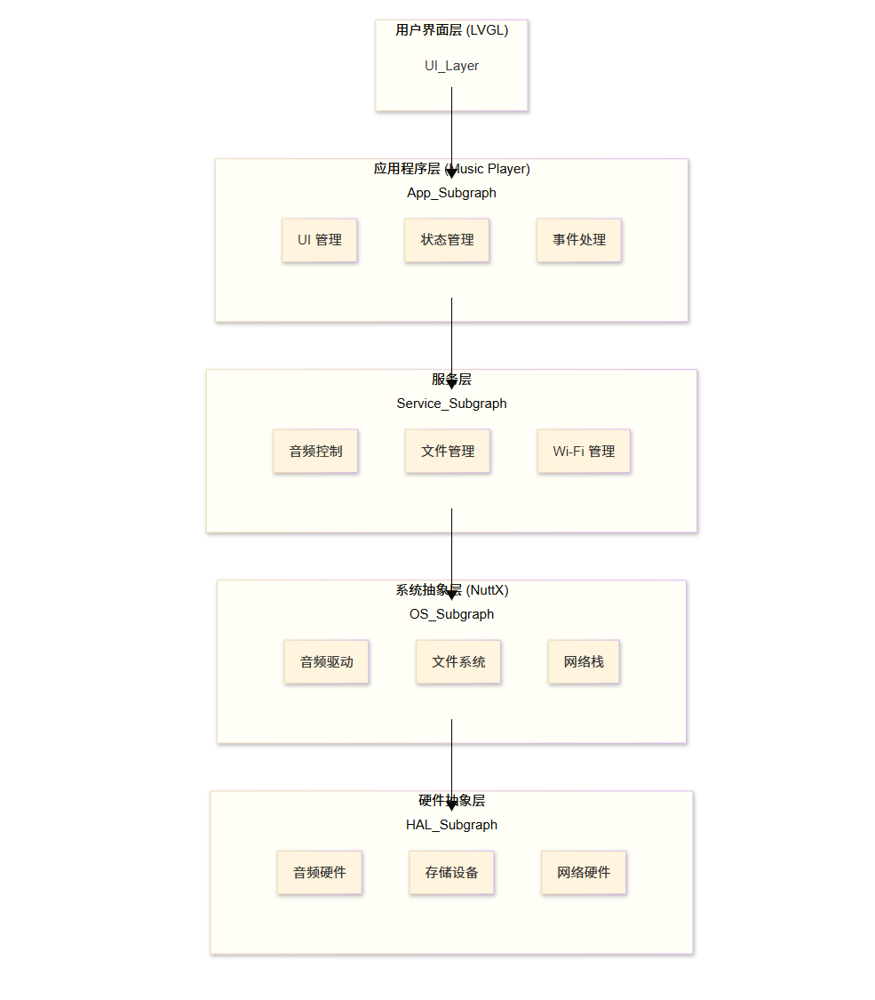
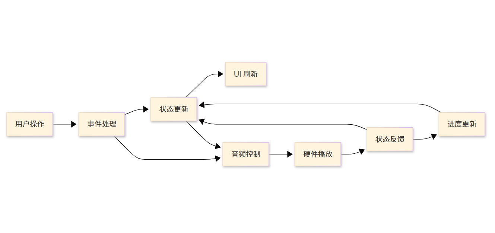
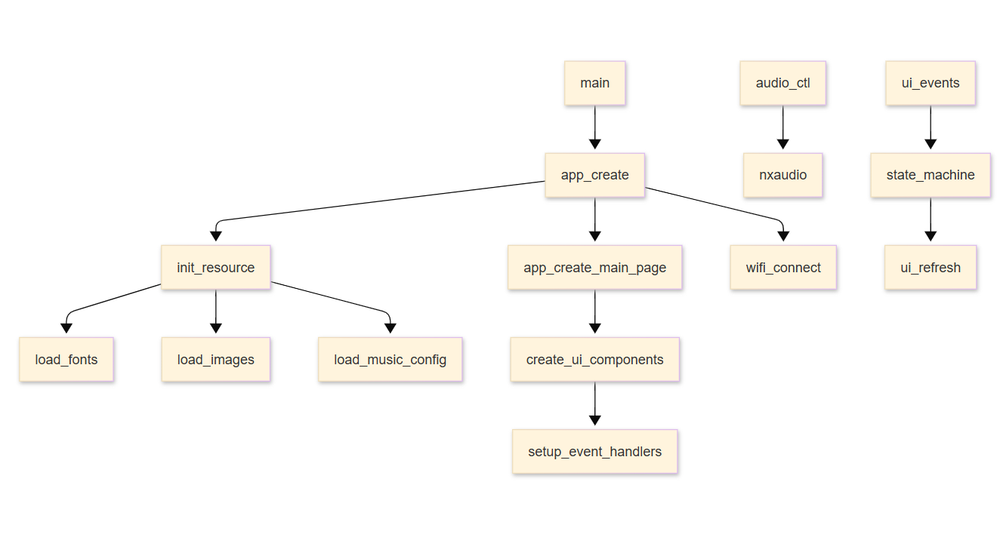

# Vela 音乐播放器 🎵

基于 OpenVela 系统的现代化嵌入式音乐播放器，采用先进的 LVGL 图形库开发。专为车载环境设计，提供专业级的用户界面和卓越的音频体验，支持 MP3/WAV 格式、Wi-Fi 连接和智能播放列表管理。

## 📋 目录

- [项目简介](#项目简介)
- [功能特性](#功能特性)
- [系统要求](#系统要求)
- [项目结构](#项目结构)
- [快速开始](#快速开始)
- [配置说明](#配置说明)
- [构建指南](#构建指南)
- [部署运行](#部署运行)
- [自定义指南](#自定义指南)
- [故障排除](#故障排除)
- [技术架构](#技术架构)
- [API 参考](#api-参考)
- [贡献指南](#贡献指南)

## 🎵 项目简介

Vela 高级车载音乐播放器是一个功能完整的嵌入式音乐播放器，专为 OpenVela 系统和车载环境设计。它提供了现代化的车载 UI 界面，支持高质量音频播放、智能播放列表管理、启动页面、音量控制等功能。应用程序采用先进的模块化架构设计，易于扩展和维护。

### 主要亮点

- 🚗 **车载专用设计**：专为车载环境优化的现代化界面
- 🎨 **高级 UI 系统**：基于 LVGL 的精美图形界面，包含启动页面、主界面、播放列表
- 🎵 **多格式音频**：支持 MP3 和 WAV 格式音频文件播放
- 📱 **触屏友好**：完整的触屏操作支持，适配长方形模拟器
- 🌐 **网络功能**：内置 Wi-Fi 连接管理
- ⚡ **高性能**：优化的嵌入式系统性能，模块化音频处理
- 🔧 **模块化架构**：启动页面、播放列表管理器独立模块设计
- 🎛️ **专业播放列表**：高级播放列表管理，支持搜索、排序、动画

## ✨ 功能特性

### 核心功能
- ▶️ 音频播放控制（播放/暂停/停止）
- ⏭️ 上一首/下一首切换
- 🔊 智能音量调节控制
- 📋 高级播放列表管理（独立模块）
- 🕒 实时播放进度显示
- 📊 顶部状态栏（时间、日期、Wi-Fi、电池）
- 🎵 多格式音频支持（MP3/WAV）

### 界面功能
- 🚗 **车载专用界面**：现代化车载风格设计
- 🌟 **启动页面**：品牌 Logo 动画和加载效果
- 🖼️ **动态专辑封面**：圆形封面容器，完整图片显示
- 📱 **长方形适配**：专为模拟器长方形屏幕优化
- 🎭 **高级样式系统**：磨砂玻璃、渐变、霓虹蓝主题
- 📜 **智能播放列表**：搜索、排序、动画效果
- 🎛️ **专业音量条**：可视化音量控制
- 📊 **滚动歌曲信息**：长标题自动滚动显示

### 系统功能
- 🌐 Wi-Fi 网络连接管理
- 📁 完整文件系统集成
- 🔧 JSON 配置文件管理
- 📊 系统资源实时监控
- 🏗️ 模块化架构设计
- ⚡ 高性能音频解码（libmad）

## 🔧 系统要求

### 硬件要求
- **处理器**：ARM Cortex-A7 或更高
- **内存**：至少 128MB RAM
- **存储**：至少 256MB 闪存
- **显示**：1280x800 分辨率触摸屏
- **音频**：PCM 音频输出支持

### 软件要求
- **操作系统**：OpenVela
- **图形库**：LVGL 8.x
- **音频库**：NuttX Audio 框架
- **网络**：Wi-Fi 驱动支持

### 开发环境
- **编译器**：arm-none-eabi-gcc
- **构建系统**：Make
- **调试工具**：ADB
- **主机系统**：Linux (推荐 Ubuntu 22.04)

## 📁 项目结构

```
music_player/
├── 核心模块/                      # 主要应用代码
│   ├── music_player.c           # 主应用逻辑和车载UI界面
│   ├── music_player.h           # 主应用头文件和数据结构
│   ├── music_player_main.c      # 应用程序入口点
│   ├── splash_screen.c          # 启动页面模块（独立）
│   ├── playlist_manager.c       # 播放列表管理器（独立）
│   └── playlist_manager.h       # 播放列表管理器头文件
├── 音频处理模块/                  # 音频相关代码
│   ├── audio_ctl.c              # 音频控制模块（支持MP3/WAV）
│   └── audio_ctl.h              # 音频控制头文件
├── 网络模块/                      # 网络连接代码
│   ├── wifi.c                   # Wi-Fi 管理模块
│   └── wifi.h                   # Wi-Fi 管理头文件
├── res/                         # 资源文件目录
│   ├── fonts/                   # 字体文件
│   │   ├── MiSans-Normal.ttf   # 常规字体
│   │   └── MiSans-Semibold.ttf # 半粗体字体
│   ├── icons/                   # 图标文件
│   │   ├── logo_vinyl.png      # 启动页面旋转Logo
│   │   ├── music_page.png      # 统一专辑封面
│   │   ├── audio.png           # 音频图标
│   │   ├── music.png           # 音乐图标
│   │   ├── mute.png            # 静音图标
│   │   ├── next.png            # 下一首图标
│   │   ├── nocover.png         # 无封面占位图
│   │   ├── pause.png           # 暂停图标
│   │   ├── play.png            # 播放图标
│   │   ├── playlist.png        # 播放列表图标
│   │   └── previous.png        # 上一首图标
│   ├── musics/                  # 音乐文件目录
│   │   ├── manifest.json       # 音乐列表配置（更新版）
│   │   ├── *.mp3               # MP3音频文件
│   │   ├── *.wav               # WAV音频文件
│   │   └── music_page.png      # 专辑封面
│   └── config.json             # 全局配置文件（Wi-Fi等）
├── 构建配置/                      # 构建系统文件
│   ├── Kconfig                 # 内核配置选项
│   ├── Makefile                # 主构建文件（包含新模块）
│   ├── Make.defs               # 构建定义
│   └── Make.dep                # 构建依赖
├── 文档/                          # 项目文档
│   ├── README.md               # 主要文档（本文件）
│   ├── MP3_SUPPORT.md          # MP3支持详细说明
│   └── docs_png/               # 文档图片资源
└── scripts/                     # 自动化脚本（项目根目录）
    ├── run_music_player_gui.sh     # GUI模式启动脚本
    ├── run_music_player_headless.sh # 无头模式启动脚本
    ├── fix_mp3_playback.sh         # MP3问题诊断修复脚本
    └── test_mp3_complete.sh        # 完整MP3测试脚本
```

### 核心模块说明

#### 1. music_player.c/h - 主应用模块
- **功能**：应用程序主逻辑和车载UI界面
- **职责**：车载UI管理、状态控制、事件处理、时间日期显示
- **关键特性**：
  - 现代化车载界面设计（深空灰背景、霓虹蓝主题）
  - 顶部状态栏（Wi-Fi、电池、时间、日期）
  - 圆形专辑封面容器，完整图片显示
  - 滚动歌曲信息显示
  - 高级样式系统（磨砂玻璃、渐变效果）
- **关键结构**：
  - `struct ctx_s`：运行时上下文
  - `struct resource_s`：UI 资源管理
  - `album_info_t`：专辑信息结构

#### 2. splash_screen.c - 启动页面模块（独立）
- **功能**：品牌启动页面和加载动画
- **职责**：应用启动时的品牌展示和用户体验
- **关键特性**：
  - "Vela Audio" 品牌Logo显示
  - "Music Connects Souls" 标语
  - 旋转唱片动画效果
  - 淡入淡出动画过渡
  - 自动跳转到主界面

#### 3. playlist_manager.c/h - 播放列表管理器（独立）
- **功能**：专业播放列表管理
- **职责**：播放列表显示、搜索、排序、交互
- **关键特性**：
  - 全屏磨砂玻璃背景
  - 搜索栏和排序按钮
  - 动画进入和退出效果
  - 当前播放歌曲指示器（♪）
  - 悬停和点击交互效果

#### 4. audio_ctl.c/h - 音频处理模块
- **功能**：多格式音频控制模块
- **职责**：音频播放、暂停、停止、音量控制、格式解码
- **支持格式**：MP3（libmad）、WAV 音频文件
- **关键特性**：
  - 自动格式检测
  - 高质量MP3解码
  - 实时流式处理
  - 低内存占用设计
- **接口**：NuttX Audio 框架

#### 5. wifi.c/h - 网络模块
- **功能**：Wi-Fi 连接管理
- **职责**：网络连接、配置管理
- **配置**：基于 config.json（已更新为vela_network）

#### 6. 资源文件管理
- **字体**：LVGL内置 Montserrat 字体系列
- **图标**：车载风格 PNG 图标，包含启动Logo
- **音频**：MP3/WAV 格式音乐文件
- **配置**：JSON 格式配置文件，包含音乐元数据

## 🚀 快速开始

### 1. 环境准备

```bash
# 安装必要的工具
sudo apt update
sudo apt install -y android-tools-adb build-essential git

# 克隆 OpenVela 仓库
git clone <openvela-repo-url>
cd vela_code
```

### 2. 配置项目

```bash
# 进入项目根目录
cd /root/vela_code

# 配置音乐播放器
./build.sh vendor/openvela/boards/vela/configs/goldfish-armeabi-v7a-ap menuconfig

# 或者直接编辑配置文件
echo "CONFIG_LVX_USE_DEMO_MUSIC_PLAYER=y" >> vendor/openvela/boards/vela/configs/goldfish-armeabi-v7a-ap/defconfig
echo 'CONFIG_LVX_MUSIC_PLAYER_DATA_ROOT="/data"' >> vendor/openvela/boards/vela/configs/goldfish-armeabi-v7a-ap/defconfig
```

### 3. 编译项目

```bash
# 清理构建产物
./build.sh vendor/openvela/boards/vela/configs/goldfish-armeabi-v7a-ap distclean -j8

# 开始构建
./build.sh vendor/openvela/boards/vela/configs/goldfish-armeabi-v7a-ap -j8
```

### 4. 启动模拟器

```bash
# 创建 nuttx 符号链接（如果不存在）
cd nuttx && ln -sf vela_ap.elf nuttx && cd ..

# 启动模拟器
./emulator.sh vela
```

#### 4.2 有显示环境的一键启动方案（GUI）- 推荐

```bash
# 从仓库根目录执行（自动：配置→构建→窗口模式启动→推送资源→运行播放器）
scripts/run_music_player_gui.sh
```

该脚本完成以下任务：
- 自动配置构建选项（启用内建应用、NSH 内建应用、音乐播放器、MP3支持）
- 设置资源根目录为 `/root/vela_code/apps/packages/demos/music_player`
- 按 goldfish-armeabi-v7a-ap 配置清理并构建系统
- **启动页面功能**：包含Vela Audio品牌启动页面和动画
- 窗口模式启动模拟器（需要主机具备 X11/Qt xcb 环境）
- 通过 ADB 推送音乐播放器资源到 `/data/res`
- 后台启动 `music_player` 并进行进程校验
- **新功能**：自动启用MP3支持和libmad库

新增特性：
- ✅ **MP3 支持**：已自动启用 `CONFIG_LVX_MUSIC_PLAYER_MP3_SUPPORT=y` 和 `CONFIG_LIB_MAD=y`
- 🌟 **启动页面**：包含品牌Logo和加载动画
- 🎛️ **高级播放列表**：独立模块化播放列表管理器
- 🚗 **车载界面**：现代化车载风格UI设计

注意：
- 如果出现显卡兼容性问题，可将脚本中的 `-gpu swiftshader_indirect` 改为 `-gpu off` 或根据主机环境调整。
- 脚本已包含MP3支持，无需手动配置。

#### 4.3 无头模式启动方案

```bash
# 后台运行，不需要图形环境
scripts/run_music_player_headless.sh
```

### 5. 部署资源

```bash
# 等待模拟器启动
sleep 15

# 连接 ADB
adb connect 127.0.0.1:5555

# 推送资源文件
adb -s emulator-5554 push apps/packages/demos/music_player/res /data/
```

### 6. 运行应用

```bash
# 通过 ADB Shell 启动音乐播放器
adb -s emulator-5554 shell "music_player &"
```

## ⚙️ 配置说明

### config.json 配置（已更新）

```json
{
  "wifi": {
    "ssid": "vela_network",       // Wi-Fi 网络名称（已更新）
    "pswd": "vela123456"          // Wi-Fi 密码（已更新）
  }
}
```

**注意**：已从"BenignX"更新为"Vela"品牌。请勿在代码中硬编码敏感信息，建议通过环境变量或安全存储方式加载。

### manifest.json 音乐配置（已优化）

```json
{
  "musics": [
    {
      "path": "Let Her Go.mp3",       // 支持MP3格式
      "name": "Let Her Go",           // 歌曲名称
      "artist": "Passenger",          // 真实艺术家名称
      "cover": "music_page.png",      // 统一专辑封面
      "total_time": 253000,           // 总时长（毫秒）
      "color": "#FF5722"              // 主题颜色
    },
    {
      "path": "Love Story.mp3",
      "name": "Love Story", 
      "artist": "Taylor Swift",
      "cover": "music_page.png",
      "total_time": 236000,
      "color": "#9C27B0"
    },
    {
      "path": "Levitating.mp3",
      "name": "Levitating",
      "artist": "Dua Lipa", 
      "cover": "music_page.png",
      "total_time": 203000,
      "color": "#2196F3"
    }
  ]
}
```

**更新内容**：
- ✅ 支持 MP3 格式音频文件
- ✅ 使用真实艺术家名称（不再使用"BenignX"）
- ✅ 统一使用 `music_page.png` 作为专辑封面
- ✅ 更新了真实的歌曲时长

### Kconfig 配置选项（已扩展）

```kconfig
# 基础配置
CONFIG_LVX_USE_DEMO_MUSIC_PLAYER=y             # 启用音乐播放器
CONFIG_LVX_MUSIC_PLAYER_DATA_ROOT="/root/vela_code/apps/packages/demos/music_player" # 数据根目录
CONFIG_LVX_MUSIC_PLAYER_STACKSIZE=40960        # 应用栈大小（已优化）
CONFIG_LVX_MUSIC_PLAYER_PRIORITY=100           # 应用优先级

# MP3 支持配置（新增）
CONFIG_LVX_MUSIC_PLAYER_MP3_SUPPORT=y          # 启用MP3格式支持
CONFIG_LVX_MUSIC_PLAYER_MP3_BUFFER_SIZE=8192   # MP3解码缓冲区大小
CONFIG_LIB_MAD=y                               # 启用libmad MP3解码库

# LVGL 图形配置
CONFIG_GRAPHICS_LVGL=y                         # 启用LVGL图形库
CONFIG_LV_COLOR_DEPTH_32=y                     # 32位颜色深度
CONFIG_LV_USE_CLIB_MALLOC=y                    # 使用C库内存管理
CONFIG_LV_USE_CLIB_SPRINTF=y                   # 使用C库字符串格式化
CONFIG_LV_USE_CLIB_STRING=y                    # 使用C库字符串处理
CONFIG_LV_USE_LOG=y                            # 启用LVGL日志
CONFIG_LV_USE_NUTTX=y                          # 启用NuttX平台支持
CONFIG_LV_USE_NUTTX_TOUCHSCREEN=y              # 启用触屏支持

# LVGL 字体配置
CONFIG_LV_FONT_MONTSERRAT_16=y                 # 16号字体
CONFIG_LV_FONT_MONTSERRAT_22=y                 # 22号字体  
CONFIG_LV_FONT_MONTSERRAT_24=y                 # 24号字体
CONFIG_LV_FONT_MONTSERRAT_28=y                 # 28号字体
CONFIG_LV_FONT_MONTSERRAT_48=y                 # 48号字体

# 系统支持配置
CONFIG_BUILTIN=y                               # 启用内建应用支持
CONFIG_NSH_BUILTIN_APPS=y                      # 启用NSH内建应用
CONFIG_SYSTEM_NSH=y                            # 启用NSH系统
CONFIG_SYSTEM_BUILTIN=y                        # 启用内建应用系统
```

## 🔨 构建指南

### 构建系统概述

项目使用 NuttX 构建系统，包含以下关键文件：

#### Makefile
```makefile
include $(APPDIR)/Make.defs

ifeq ($(CONFIG_LVX_USE_DEMO_MUSIC_PLAYER), y)
PROGNAME = music_player          # 程序名称
PRIORITY = 100                   # 优先级
STACKSIZE = 40960               # 栈大小（字节）
MODULE = $(CONFIG_LVX_USE_DEMO_MUSIC_PLAYER)

CSRCS = music_player.c audio_ctl.c wifi.c splash_screen.c playlist_manager.c     # C源文件（已扩展）
MAINSRC = music_player_main.c                  # 主入口文件
endif

include $(APPDIR)/Application.mk
```

#### Make.defs
```makefile
ifneq ($(CONFIG_LVX_USE_DEMO_MUSIC_PLAYER),)
CONFIGURED_APPS += $(APPDIR)/packages/demos/music_player
endif
```

### 构建选项

#### 调试版本
```bash
# 启用调试符号
./build.sh vendor/openvela/boards/vela/configs/goldfish-armeabi-v7a-ap DEBUG=1 -j8
```

#### 发布版本
```bash
# 优化构建
./build.sh vendor/openvela/boards/vela/configs/goldfish-armeabi-v7a-ap OPTIMIZE=2 -j8
```

#### 清理构建
```bash
# 完全清理
./build.sh vendor/openvela/boards/vela/configs/goldfish-armeabi-v7a-ap distclean

# 仅清理音乐播放器
make -C apps/packages/demos/music_player clean
```

### 构建产物

成功构建后会生成：
- `nuttx/vela_ap.elf`：主可执行文件
- `nuttx/vela_ap.bin`：二进制映像
- `nuttx/vela_system.bin`：系统映像
- `nuttx/vela_data.bin`：数据映像

## 🚢 部署运行

### 模拟器部署

#### 1. 启动模拟器
```bash
# 启动 QEMU 模拟器
./emulator.sh vela

# 检查模拟器状态
ps aux | grep qemu
```

#### 2. ADB 连接
```bash
# 检查 ADB 服务
adb devices

# 连接到模拟器
adb connect 127.0.0.1:5555

# 验证连接
adb -s emulator-5554 shell uname -a
```

#### 3. 文件传输
```bash
# 创建目标目录
adb -s emulator-5554 shell mkdir -p /data/res

# 推送资源文件
adb -s emulator-5554 push res/ /data/

# 验证文件
adb -s emulator-5554 shell ls -la /data/res/
```

### 硬件设备部署

#### 1. 串口连接
```bash
# 配置串口连接
minicom -s
# 设置：115200 8N1，无流控

# 或使用 screen
screen /dev/ttyUSB0 115200
```

#### 2. 网络部署
```bash
# 配置网络启动
setenv serverip 192.168.1.100
setenv ipaddr 192.168.1.200
tftp 0x40000000 vela_ap.bin
go 0x40000000
```

#### 3. 存储部署
```bash
# 烧录到 Flash
flash erase 0x00000000 0x00800000
flash write 0x40000000 0x00000000 0x00800000
```

### 运行时监控

#### 1. 系统监控
```bash
# 检查系统状态
adb shell ps
adb shell free
adb shell df -h

# 查看日志
adb shell dmesg
adb logcat
```

#### 2. 应用监控
```bash
# 检查音乐播放器进程
adb shell ps | grep music_player

# 查看应用日志
adb shell tail -f /var/log/music_player.log
```

#### 3. 性能分析
```bash
# CPU 使用率
adb shell top -p $(adb shell pidof music_player)

# 内存使用
adb shell cat /proc/$(adb shell pidof music_player)/status
```

## 🎨 自定义指南

### 添加新音乐

#### 1. 准备音频文件
```bash
# 转换音频格式（如果需要）
ffmpeg -i input.mp3 -acodec pcm_s16le -ar 44100 -ac 2 output.wav

# 准备专辑封面（推荐 300x300）
convert cover.jpg -resize 300x300 cover.png
```

#### 2. 更新配置文件
```json
{
  "musics": [
    {
      "path": "new_song.wav",
      "name": "新歌名称",
      "artist": "艺术家名称",
      "cover": "new_cover.png",
      "total_time": 240000,
      "color": "#FF5722"
    }
  ]
}
```

#### 3. 部署文件
```bash
# 复制文件到资源目录
cp new_song.wav res/musics/
cp new_cover.png res/musics/

# 推送到设备
adb push res/musics/ /data/res/musics/
```

### 自定义界面

#### 1. 修改主题颜色
```c
// 在 music_player.c 中修改
#define THEME_PRIMARY_COLOR   lv_color_hex(0x2196F3)
#define THEME_SECONDARY_COLOR lv_color_hex(0xFF5722)
#define THEME_BACKGROUND_COLOR lv_color_hex(0x121212)
```

#### 2. 调整界面布局
```c
// 修改分辨率适配
#define SCREEN_WIDTH  1280
#define SCREEN_HEIGHT 800
#define UI_SCALE_FACTOR 1.0f

// 调整控件大小
#define ALBUM_COVER_SIZE 300
#define BUTTON_SIZE 60
#define PROGRESS_BAR_HEIGHT 8
```

#### 3. 添加新功能
```c
// 添加均衡器功能
typedef struct {
    int8_t bass;
    int8_t middle;
    int8_t treble;
} equalizer_t;

static void app_equalizer_apply(equalizer_t* eq) {
    // 实现均衡器逻辑
}
```

### 扩展音频格式

#### 1. MP3 支持（已实现）

音乐播放器现已支持MP3格式！要启用MP3支持，需要：

**启用配置选项：**
```bash
# 在配置文件中启用
CONFIG_LVX_MUSIC_PLAYER_MP3_SUPPORT=y
CONFIG_LVX_MUSIC_PLAYER_MP3_BUFFER_SIZE=8192
CONFIG_LIB_MAD=y  # 确保libmad库可用
```

**支持的功能：**
- ✅ MP3文件自动检测（基于文件扩展名）
- ✅ 使用libmad进行高质量MP3解码
- ✅ 支持各种采样率和比特率
- ✅ 立体声和单声道支持
- ✅ 实时流式解码，内存占用低

**使用方法：**
```json
// 在manifest.json中添加MP3文件
{
  "path": "song.mp3",
  "name": "My MP3 Song",
  "artist": "Artist Name",
  "cover": "cover.png",
  "total_time": 240000,
  "color": "#FF5722"
}
```

**技术实现：**
```c
// 音频格式自动检测
int format = audio_ctl_detect_format(filename);

// MP3解码器初始化
#ifdef CONFIG_LVX_MUSIC_PLAYER_MP3_SUPPORT
mp3_decoder_s decoder;
mp3_decoder_init(&decoder);

// 解码MP3数据到PCM
mp3_decoder_decode(&decoder, input_data, input_size, 
                   output_pcm, &output_size);
#endif
```

#### 2. 添加其他音频格式支持

您可以参考MP3实现来添加其他格式：

```c
// 添加AAC支持示例
#ifdef CONFIG_LVX_MUSIC_PLAYER_AAC_SUPPORT
#include <faad.h>

typedef struct aac_decoder {
    faacDecHandle handle;
    // ... AAC特定字段
} aac_decoder_s;

int aac_decoder_init(aac_decoder_s *decoder) {
    decoder->handle = faacDecOpen();
    // ... 初始化逻辑
}
#endif
```

#### 3. 配置构建系统
```kconfig
# 现有的MP3配置
config LVX_MUSIC_PLAYER_MP3_SUPPORT
    bool "Enable MP3 audio format support"
    default n
    depends on LIB_MAD
    
config LVX_MUSIC_PLAYER_MP3_BUFFER_SIZE
    int "MP3 decode buffer size"
    default 8192
    depends on LVX_MUSIC_PLAYER_MP3_SUPPORT
```

## 🔧 故障排除

### 常见问题

#### 1. 编译错误

**问题**：`music_player: command not found`
```bash
# 解决方案：检查配置
grep -r LVX_USE_DEMO_MUSIC_PLAYER vendor/openvela/boards/vela/configs/goldfish-armeabi-v7a-ap/defconfig

# 重新配置和编译
./build.sh vendor/openvela/boards/vela/configs/goldfish-armeabi-v7a-ap distclean
./build.sh vendor/openvela/boards/vela/configs/goldfish-armeabi-v7a-ap -j8
```

**问题**：栈溢出错误
```bash
# 解决方案：增加栈大小
# 编辑 Makefile
STACKSIZE = 65536  # 从 32768 增加到 65536
```

#### 2. 运行时错误

**问题**：找不到资源文件
```bash
# 检查文件是否存在
adb shell ls -la /data/res/

# 重新推送资源
adb push res/ /data/
```

**问题**：音频播放失败
```bash
# 检查音频设备
adb shell ls -la /dev/audio/

# 检查音频格式
file res/musics/*.wav
```

#### 3. 模拟器问题

**问题**：模拟器启动失败
```bash
# 检查 nuttx 文件
ls -la nuttx/nuttx

# 重新创建符号链接
cd nuttx && rm -f nuttx && ln -sf vela_ap.elf nuttx
```

**问题**：ADB 连接失败
```bash
# 检查端口
netstat -tlnp | grep 555

# 重新连接
adb disconnect 127.0.0.1:5555
adb connect 127.0.0.1:5555
```

### 调试技巧

#### 1. 使用日志输出
```c
// 添加调试日志
#define MUSIC_DEBUG 1

#if MUSIC_DEBUG
#define DLOG(fmt, ...) printf("[MUSIC] " fmt "\n", ##__VA_ARGS__)
#else
#define DLOG(fmt, ...)
#endif

// 在关键位置添加日志
DLOG("Loading audio file: %s", file_path);
DLOG("Audio playback started, duration: %lu ms", duration);
```

#### 2. 使用 GDB 调试
```bash
# 启动 GDB 服务器
./emulator.sh vela -s -S

# 连接 GDB
arm-none-eabi-gdb nuttx/nuttx
(gdb) target remote localhost:1234
(gdb) b main
(gdb) c
```

#### 3. 内存分析
```c
// 添加内存使用统计
static void print_memory_usage(void) {
    struct mallinfo info = mallinfo();
    printf("Memory usage:\n");
    printf("  Total heap: %d bytes\n", info.arena);
    printf("  Used heap: %d bytes\n", info.uordblks);
    printf("  Free heap: %d bytes\n", info.fordblks);
}
```

### 性能优化

#### 1. 界面优化
```c
// 减少不必要的重绘
lv_obj_add_flag(obj, LV_OBJ_FLAG_FLOATING);

// 使用缓存提高性能
lv_obj_set_style_bg_opa(obj, LV_OPA_COVER, 0);
```

#### 2. 音频优化
```c
// 优化音频缓冲区大小
#define AUDIO_BUFFER_SIZE (4096 * 4)  // 16KB 缓冲区

// 使用DMA传输
static int audio_dma_setup(void) {
    // 配置 DMA 音频传输
}
```

#### 3. 内存优化
```c
// 预分配内存池
static uint8_t audio_buffer_pool[AUDIO_BUFFER_SIZE * 4];
static uint8_t ui_buffer_pool[UI_BUFFER_SIZE];

// 使用对象池管理
static album_info_t album_pool[MAX_ALBUMS];
```

## 🏗️ 技术架构

### 架构概览



Vela 高级车载音乐播放器采用现代化模块化分层架构设计，从下到上包括：

- **硬件抽象层**：音频硬件、存储设备、网络硬件的底层驱动
- **系统抽象层 (NuttX)**：音频驱动、文件系统、网络栈的系统级服务  
- **音频解码层**：MP3解码器(libmad)、WAV解码器、格式自动检测
- **服务层**：音频控制、文件管理、Wi-Fi管理等应用服务
- **业务逻辑层**：状态管理、播放控制、播放列表逻辑
- **UI模块层**：启动页面模块、主界面模块、播放列表管理器模块
- **用户界面层 (LVGL)**：车载风格图形界面渲染和触屏交互

### 数据流图



系统的数据流主要包括四个主要路径：

1. **应用启动流**：`main()` → `splash_screen_create()` → 启动动画 → `app_create()` → 主界面
2. **用户交互流**：用户操作 → 事件处理 → 状态更新 → UI刷新 → 播放列表管理器
3. **音频播放流**：格式检测 → MP3/WAV解码 → 音频控制 → 硬件播放 → 状态反馈 → 进度更新  
4. **模块通信流**：主界面 ↔ 播放列表管理器 ↔ 音频控制器 ↔ 状态管理

这种模块化设计确保了用户界面响应性、音频播放的稳定性和代码的可维护性。

### 模块关系



新架构下的模块间依赖关系更加清晰明确：

- **main** 函数首先调用 **splash_screen_create()** 创建启动页面
- **splash_screen** 模块在动画完成后自动调用 **app_create()** 
- **init_resource** 负责加载LVGL字体、图片和音乐配置JSON
- **app_create_main_page** 创建车载风格UI组件并设置事件处理
- **playlist_manager** 模块独立管理播放列表UI和交互逻辑
- **audio_ctl** 模块支持MP3/WAV格式，通过 **nxaudio** 与底层音频系统交互
- **ui_events** 触发 **state_machine** 状态转换，同时更新主界面和播放列表显示
- 各模块通过明确的API接口进行通信，支持模块间解耦

### 关键数据结构

#### 运行时上下文
```c
struct ctx_s {
    bool resource_healthy_check;          // 资源健康检查
    album_info_t* current_album;          // 当前专辑
    lv_obj_t* current_album_related_obj;  // 关联UI对象
    
    uint16_t volume;                      // 音量
    play_status_t play_status_prev;       // 上一次播放状态
    play_status_t play_status;            // 当前播放状态
    uint64_t current_time;                // 当前播放时间
    
    struct {
        lv_timer_t* volume_bar_countdown;      // 音量条倒计时
        lv_timer_t* playback_progress_update;  // 播放进度更新
        lv_timer_t* refresh_date_time;         // 时间日期刷新（新增）
    } timers;
    
    audioctl_s* audioctl;                 // 音频控制句柄
};
```

#### 资源管理
```c
struct resource_s {
    struct {
        lv_obj_t* time;                    // 时间显示
        lv_obj_t* date;                    // 日期显示  
        lv_obj_t* player_group;            // 播放器组
        lv_obj_t* album_cover_container;   // 圆形封面容器（新增）
        lv_obj_t* volume_bar;              // 音量条
        lv_obj_t* volume_bar_indic;        // 音量指示器
        lv_obj_t* playlist;                // 播放列表（原基础列表）
        lv_obj_t* frosted_bg;              // 磨砂玻璃背景（新增）
        // ... 更多UI组件
    } ui;
    
    struct {
        struct { const lv_font_t* normal; } size_16;  // 已更新为const
        struct { const lv_font_t* bold; } size_22;
        struct { const lv_font_t* normal; } size_24;
        struct { const lv_font_t* normal; } size_28;
        struct { const lv_font_t* bold; } size_60;    // 车载大标题字体
    } fonts;
    
    struct {
        lv_style_t button_default;         // 按钮默认样式
        lv_style_t button_pressed;         // 按钮按下样式
        lv_style_t circular_cover;          // 圆形封面样式（新增）
        lv_style_t frosted_glass;           // 磨砂玻璃样式（新增）
        lv_style_t modern_card;             // 现代卡片样式（新增）
    } styles;
    
    album_info_t* albums;                  // 专辑数组
    uint8_t album_count;                   // 专辑数量
};
```

### 状态机设计

```c
typedef enum {
    PLAY_STATUS_STOP,    // 停止
    PLAY_STATUS_PLAY,    // 播放
    PLAY_STATUS_PAUSE,   // 暂停
} play_status_t;

// 状态转换表
static const state_transition_t transitions[] = {
    {PLAY_STATUS_STOP,  PLAY_STATUS_PLAY,  action_start_playback},
    {PLAY_STATUS_PLAY,  PLAY_STATUS_PAUSE, action_pause_playback},
    {PLAY_STATUS_PAUSE, PLAY_STATUS_PLAY,  action_resume_playback},
    {PLAY_STATUS_PLAY,  PLAY_STATUS_STOP,  action_stop_playback},
    {PLAY_STATUS_PAUSE, PLAY_STATUS_STOP,  action_stop_playback},
};
```

## 📚 API 参考

### 核心 API

#### 应用程序控制
```c
/**
 * @brief 创建并初始化音乐播放器应用
 * @return void
 */
void app_create(void);

/**
 * @brief 设置播放状态
 * @param status 播放状态
 */
static void app_set_play_status(play_status_t status);

/**
 * @brief 切换到指定专辑（现已公开，供播放列表管理器调用）
 * @param index 专辑索引
 */
void app_switch_to_album(int index);

/**
 * @brief 设置音量
 * @param volume 音量值 (0-100)
 */
static void app_set_volume(uint16_t volume);

/**
 * @brief 刷新时间日期显示
 */
static void app_refresh_date_time(void);

/**
 * @brief 启动时间日期更新定时器
 */
static void app_start_updating_date_time(void);
```

#### 启动页面模块 API
```c
/**
 * @brief 创建启动页面
 * @note 自动显示Logo动画，2秒后跳转主界面
 */
void splash_screen_create(void);
```

#### 播放列表管理器 API
```c
/**
 * @brief 创建专业播放列表界面
 * @param parent 父容器
 */
void playlist_manager_create(lv_obj_t* parent);

/**
 * @brief 刷新播放列表显示
 */
void playlist_manager_refresh(void);

/**
 * @brief 关闭播放列表
 */
void playlist_manager_close(void);

/**
 * @brief 检查播放列表是否打开
 * @return true if open, false if closed
 */
bool playlist_manager_is_open(void);
```

#### 音频控制 API（已增强）
```c
/**
 * @brief 初始化音频控制器（支持多格式）
 * @param file_path 音频文件路径（支持MP3/WAV）
 * @return 音频控制句柄
 */
audioctl_s* audio_ctl_init_nxaudio(const char* file_path);

/**
 * @brief 检测音频文件格式
 * @param filename 文件名
 * @return 音频格式类型（FORMAT_MP3/FORMAT_WAV）
 */
int audio_ctl_detect_format(const char* filename);

/**
 * @brief 开始播放
 * @param audioctl 音频控制句柄
 * @return 0 成功, -1 失败
 */
int audio_ctl_start(audioctl_s* audioctl);

/**
 * @brief 暂停播放
 * @param audioctl 音频控制句柄
 * @return 0 成功, -1 失败
 */
int audio_ctl_pause(audioctl_s* audioctl);

/**
 * @brief 停止播放
 * @param audioctl 音频控制句柄
 * @return 0 成功, -1 失败
 */
int audio_ctl_stop(audioctl_s* audioctl);

/**
 * @brief 设置音量
 * @param audioctl 音频控制句柄
 * @param volume 音量值
 * @return 0 成功, -1 失败
 */
int audio_ctl_set_volume(audioctl_s* audioctl, uint16_t volume);

#ifdef CONFIG_LVX_MUSIC_PLAYER_MP3_SUPPORT
/**
 * @brief 初始化MP3解码器
 * @param decoder MP3解码器结构
 * @return 0 成功, -1 失败
 */
int mp3_decoder_init(mp3_decoder_s* decoder);

/**
 * @brief 解码MP3数据
 * @param decoder MP3解码器
 * @param input_data 输入MP3数据
 * @param input_size 输入数据大小
 * @param output_pcm 输出PCM数据
 * @param output_size 输出数据大小
 * @return 解码的字节数，-1表示失败
 */
int mp3_decoder_decode(mp3_decoder_s* decoder, const uint8_t* input_data, 
                       size_t input_size, int16_t* output_pcm, size_t* output_size);
#endif
```

#### Wi-Fi 管理 API
```c
/**
 * @brief Wi-Fi 配置结构
 */
typedef struct {
    char ssid[64];      // 网络名称
    char psk[128];      // 密码
    uint32_t conn_delay; // 连接延迟
} wifi_conf_t;

/**
 * @brief 连接 Wi-Fi
 * @param conf Wi-Fi 配置
 * @return 0 成功, -1 失败
 */
int wifi_connect(wifi_conf_t* conf);

/**
 * @brief 断开 Wi-Fi 连接
 * @return 0 成功, -1 失败
 */
int wifi_disconnect(void);

/**
 * @brief 获取连接状态
 * @return true 已连接, false 未连接
 */
bool wifi_is_connected(void);
```

### UI 组件 API

#### 事件处理
```c
/**
 * @brief 播放按钮事件处理
 * @param e 事件对象
 */
static void app_play_status_event_handler(lv_event_t* e);

/**
 * @brief 音量条事件处理
 * @param e 事件对象
 */
static void app_volume_bar_event_handler(lv_event_t* e);

/**
 * @brief 播放列表事件处理
 * @param e 事件对象
 */
static void app_playlist_event_handler(lv_event_t* e);
```

#### UI 刷新
```c
/**
 * @brief 刷新专辑信息显示
 */
static void app_refresh_album_info(void);

/**
 * @brief 刷新播放进度
 */
static void app_refresh_playback_progress(void);

/**
 * @brief 刷新音量条
 */
static void app_refresh_volume_bar(void);

/**
 * @brief 刷新播放列表
 */
static void app_refresh_playlist(void);
```

### 配置 API

#### 配置文件管理
```c
/**
 * @brief 读取配置文件
 */
static void read_configs(void);

/**
 * @brief 重新加载音乐配置
 */
static void reload_music_config(void);

/**
 * @brief 保存配置
 * @param config 配置结构
 * @return 0 成功, -1 失败
 */
int save_config(const config_t* config);
```

#### 资源管理
```c
/**
 * @brief 初始化资源
 * @return true 成功, false 失败
 */
static bool init_resource(void);

/**
 * @brief 加载字体资源
 * @return true 成功, false 失败
 */
static bool load_fonts(void);

/**
 * @brief 加载图片资源
 * @return true 成功, false 失败
 */
static bool load_images(void);

/**
 * @brief 释放资源
 */
static void cleanup_resources(void);
```

### 错误代码

```c
#define MUSIC_ERROR_OK              0    // 成功
#define MUSIC_ERROR_INVALID_PARAM  -1    // 无效参数
#define MUSIC_ERROR_NO_MEMORY      -2    // 内存不足
#define MUSIC_ERROR_FILE_NOT_FOUND -3    // 文件未找到
#define MUSIC_ERROR_AUDIO_INIT     -4    // 音频初始化失败
#define MUSIC_ERROR_NETWORK        -5    // 网络错误
#define MUSIC_ERROR_CONFIG         -6    // 配置错误
```

## 贡献指南

### 开发流程

1. **Fork 项目**
   ```bash
   git clone https://github.com/your-username/openvela-music-player.git
   cd openvela-music-player
   ```

2. **创建功能分支**
   ```bash
   git checkout -b feature/new-feature
   ```

3. **开发和测试**
   ```bash
   # 开发新功能
   # 编写测试用例
   # 运行测试
   make test
   ```

4. **提交更改**
   ```bash
   git add .
   git commit -m "feat: add new audio format support"
   ```

5. **推送和PR**
   ```bash
   git push origin feature/new-feature
   # 创建 Pull Request
   ```

### 代码规范

#### C 代码风格
```c
// 函数命名：snake_case
static void app_create_main_page(void);

// 变量命名：snake_case
static bool resource_healthy_check = false;

// 常量命名：UPPER_CASE
#define MAX_ALBUM_COUNT 100

// 结构体命名：snake_case_t
typedef struct album_info_s {
    const char* name;
    const char* artist;
} album_info_t;
```

#### 注释规范
```c
/**
 * @brief 函数简要描述
 * @param param1 参数1描述
 * @param param2 参数2描述
 * @return 返回值描述
 * @note 注意事项
 * @warning 警告信息
 */
int function_name(int param1, const char* param2);
```

#### 提交信息规范
```
feat: 新功能
fix: 修复bug
docs: 文档更新
style: 代码格式调整
refactor: 重构
test: 测试相关
chore: 构建/工具相关

示例：
feat: add MP3 audio format support
fix: resolve memory leak in audio playback
docs: update API documentation
```

### 测试指南

#### 单元测试
```c
// test/test_audio_ctl.c
#include "unity.h"
#include "audio_ctl.h"

void test_audio_ctl_init(void) {
    audioctl_s* ctl = audio_ctl_init_nxaudio("test.wav");
    TEST_ASSERT_NOT_NULL(ctl);
    audio_ctl_uninit_nxaudio(ctl);
}

void test_audio_ctl_volume(void) {
    audioctl_s* ctl = audio_ctl_init_nxaudio("test.wav");
    int result = audio_ctl_set_volume(ctl, 50);
    TEST_ASSERT_EQUAL(0, result);
    audio_ctl_uninit_nxaudio(ctl);
}
```

#### 集成测试
```bash
# 运行完整测试套件
./scripts/run_tests.sh

# 运行性能测试
./scripts/performance_test.sh

# 运行内存泄漏测试
valgrind --leak-check=full ./music_player
```

### 文档贡献

1. **API 文档**：使用 Doxygen 格式
2. **用户文档**：使用 Markdown 格式
3. **代码示例**：提供完整可运行的示例
4. **翻译**：支持多语言文档

### 问题报告

提交 Issue 时请包含：
- 操作系统和版本
- OpenVela 版本
- 复现步骤
- 期望行为
- 实际行为
- 相关日志

---

## 📄 许可证

本项目采用 Apache License 2.0 开源许可证。详情请参阅 [LICENSE](LICENSE) 文件。

## 🙏 致谢

- **OpenVela 团队**：提供优秀的嵌入式操作系统平台
- **LVGL 社区**：提供强大的图形库和车载UI组件支持
- **NuttX 项目**：提供可靠的实时操作系统内核和音频框架
- **libmad 开发者**：提供高质量的MP3解码库
- **所有贡献者**：感谢每一个贡献代码、文档和建议的开发者
- **Vela 品牌**：感谢品牌支持和UI设计指导

## 📞 联系我们

- **项目主页**：https://github.com/openvela/music-player
- **文档站点**：https://docs.openvela.org/music-player  
- **问题反馈**：https://github.com/openvela/music-player/issues
- **讨论社区**：https://forum.openvela.org
- **Vela Audio**：vela@music-player.com

## 🆕 更新日志

### v2.0.0 - 车载专业版 (2024-12-18)
- ✅ **全新车载UI设计**：现代化车载风格界面
- ✅ **启动页面模块**：品牌Logo动画和加载效果
- ✅ **播放列表管理器**：独立模块化播放列表
- ✅ **MP3格式支持**：libmad高质量解码
- ✅ **顶部状态栏**：时间、日期、Wi-Fi、电池显示
- ✅ **高级样式系统**：磨砂玻璃、渐变、霓虹主题
- ✅ **模块化架构**：更好的代码组织和可维护性

### v1.0.0 - 基础版本 (2024-08-20)
- ✅ 基础音乐播放功能
- ✅ WAV格式支持
- ✅ 简单UI界面

---

*最后更新时间：2024-12-18*
*当前版本：v2.0.0 车载专业版*
